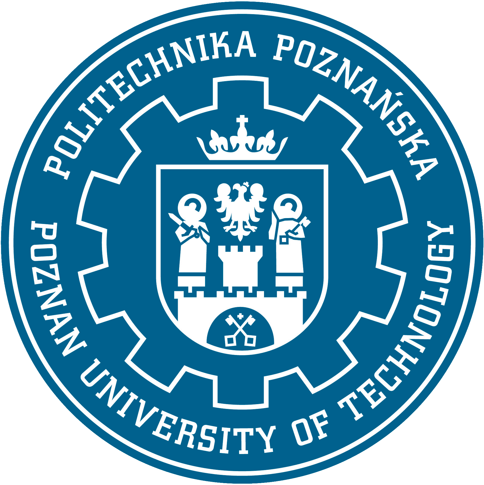

# Modelowanie i sterowanie robotów - laboratorium
## Maciej Krupka AIR semestr IV  

## Autorzy instrukcji
**Jakub Chudziński, Bartłomiej Kulecki**  
**Politechnika Poznańska**  
**Instytut Robotyki i Inteligencji Maszynowej**  

## Lab 1 - Wprowadzenie do Robotics Toolbox for Python
http://jug.put.poznan.pl/lab-misr/Lab%201%20-%20Wprowadzenie%20do%20Robotics%20Toolbox%20for%20Python.html

## Lab 2 - Modelowanie manipulatorów w RT - kinematyka prosta i odwrotna
http://jug.put.poznan.pl/lab-misr/Lab%202%20-%20Modelowanie%20manipulator%F3w%20w%20RT%20-%20kinematyka%20prosta%20i%20odwrotna.html

## Lab 3 - Metody planowania trajektorii ruchu manipulatorów w RT
http://jug.put.poznan.pl/lab-misr/Lab%203%20-%20Metody%20planowania%20trajektorii%20ruchu%20manipulator%F3w.html

## Lab 4 - Zastosowanie Ubuntu i ROS’a w robotyce
http://jug.put.poznan.pl/lab-misr/Lab%204%20-%20Zastosowanie%20Ubuntu%20i%20ROS%92a%20w%20robotyce.html

## Lab 5 - Planowanie zadań dla robota z wykorzystaniem pakietu MoveIt w ROS’ie
http://jug.put.poznan.pl/lab-misr/Lab%205%20-%20Planowanie%20zada%F1%20dla%20robota%20z%20wykorzystaniem%20pakietu%20MoveIt%20w%20ROS%92ie.html

## Lab 6 - Modelowanie i symulacja systemów robotycznych w ROS’ie
http://jug.put.poznan.pl/lab-misr/Lab%206%20-%20Modelowanie%20i%20symulacja%20system%F3w%20robotycznych%20w%20ROS%92ie.html
